

# Ride-share Churn

## Introduction
A rideshare company has a dataset of information from customers and wants to understand why customers are churning and what recommendations a group of data scientists can come up with to improve service. Churn is defined as a customer who has not used the service in the last 30 days.

To begin this project, the team loaded the data into a Pandas Dataframe and conducted the Exploratory Data Analysis.  Upon initial investigation, we decided to clean the data as follows:

- 'phone' (Phone type) was one hot encoded into features: Android, Iphone, or unspecified.  The baseline model corresponds to the unspecified phone type.
- 'avg_rating_by_driver' and 'avg_rating_of_driver' was also one hot encoded into discrete categories.  After debating betweemn filling in the missing values with column means and converting the data into dummy columns, we decided on giving it a rating threshold.  Any rating above the threshold will be a 'high rating' and lower will be 'low rating'.  The missing rating observations are of it's own category (that corresponds to the base model). We've tried both 4 and 5 for the threshold. This resulted in these two features to be converted into 4 (with 2 - being missing as baseline).
- There were only a few cities in the dataset, so these were one hot encoded as well.
- The target variable is generated by checking the last_trip_date with 2014-06-01.

## EDA and feature engineering
With our decision tree we've plotted some historgrams and cross-plotting charts to explore the data. 

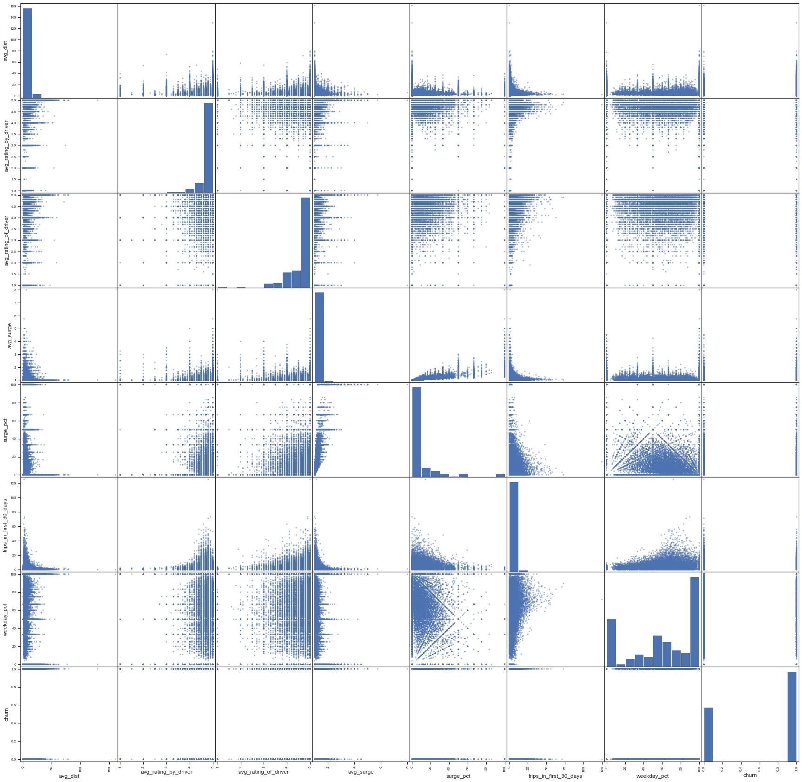

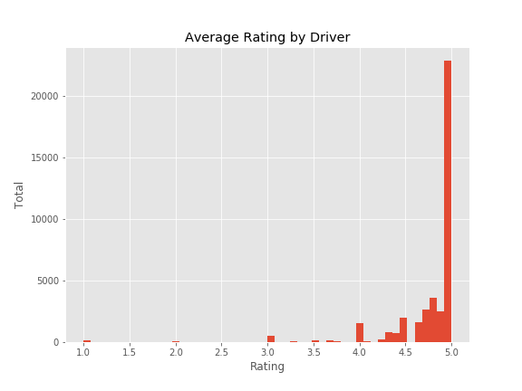

Looking at the ratings histogram, our decision to discretize the ratings into high, low, and unknown was justified, as there is a heavy prevalence of 5 star reviews, and the rest are widespread.

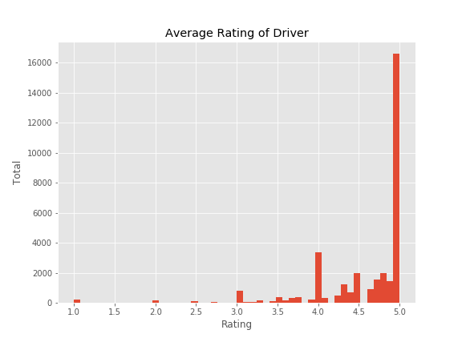

## Modeling approach

For this study, we've decided to try a few of the non-parametric models, fine-tune each model and compare the results.  The following models are considered: 

## Random Forest

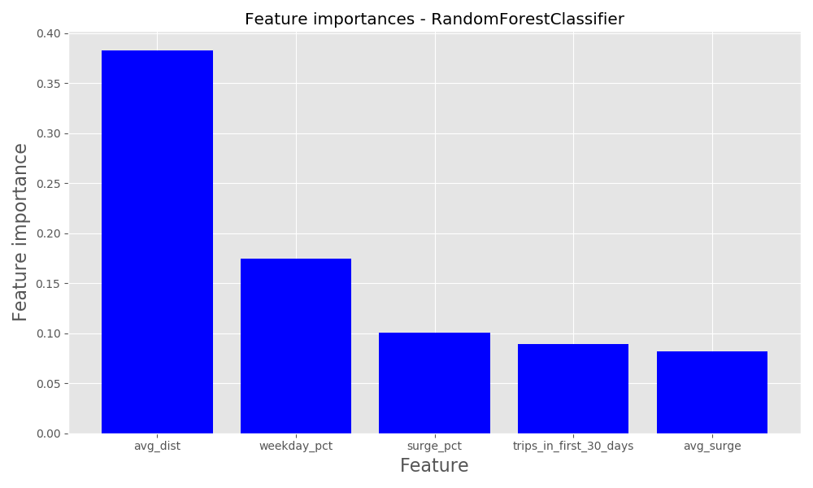

### Regular Decision Tree

Surprisingly, a regular decision tree without bagging or aggregating performed reasonably competitively with the other models. 

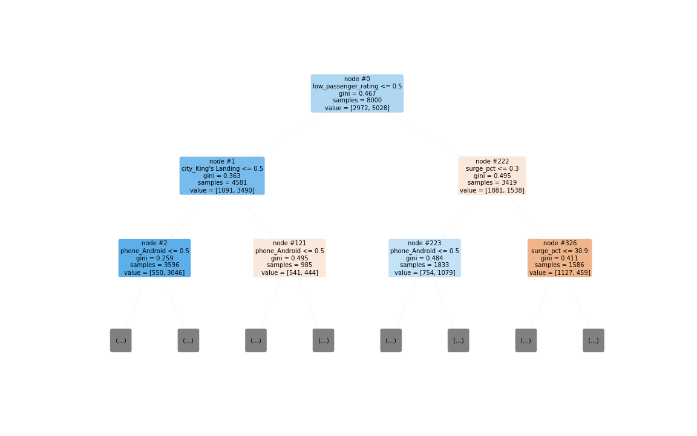

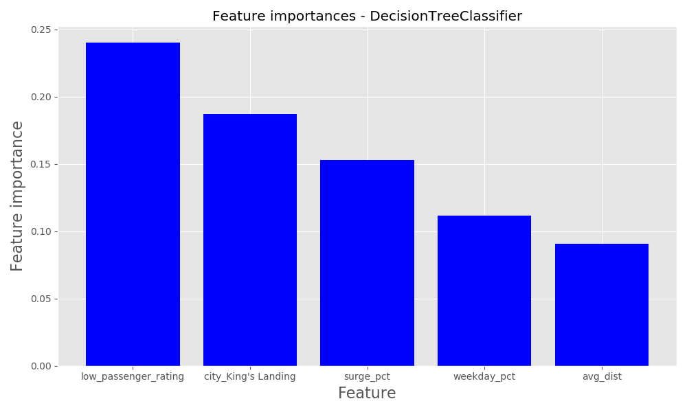

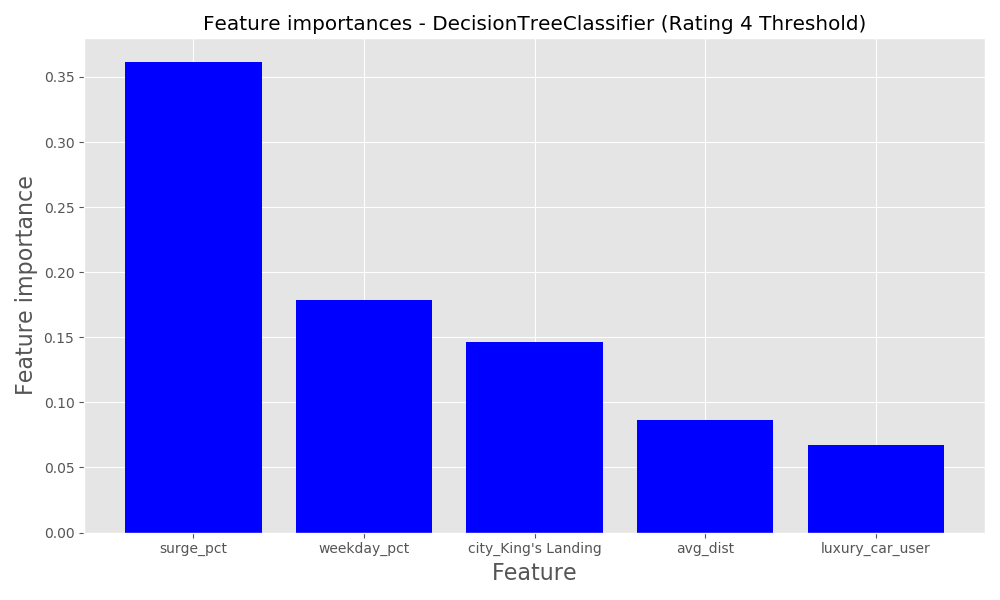

 

## Gradient Boosted Classifier

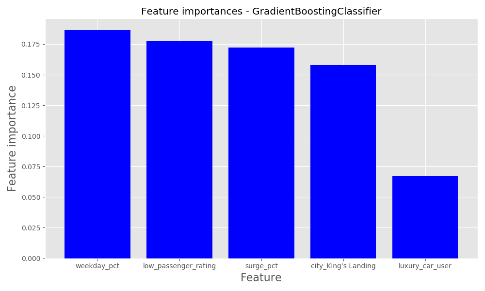

### With Adaboost

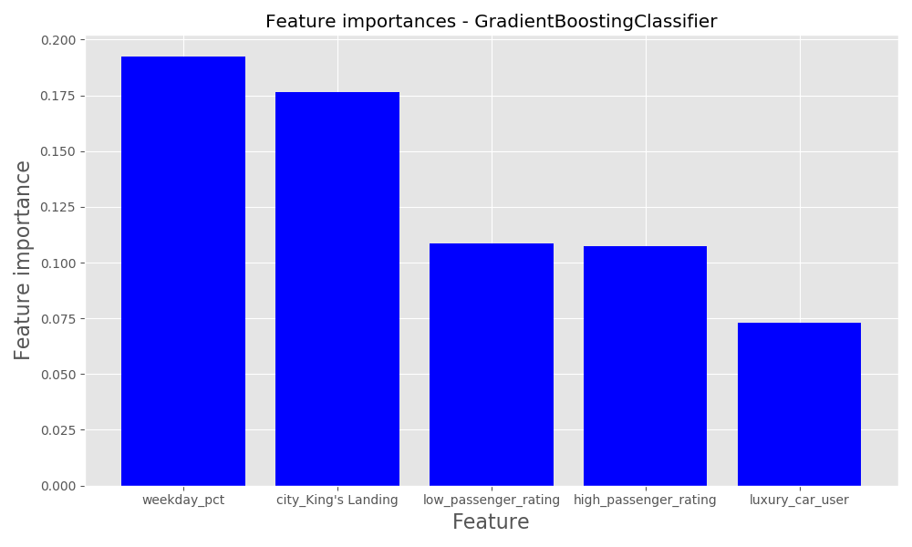

## Model Results
| Model                     |   Accuracy_CV |   Precision_CV |   Recall_CV |   Accuracy_HO |   Precision_HO |   Recall_HO |
|:--------------------------|--------------:|---------------:|------------:|--------------:|---------------:|------------:|
| GradientBoostedClassifier |      0.7966 |       0.8133 |    0.8716 |        0.7831 |       0.8060  |    0.8582  |
| AdaBoost                  |      0.7923 |       0.8063 |    0.8747 |        0.7787 |       0.7986  |    0.8619 |
| DecisionTree              |      0.7732  |       0.8145 |    0.8278 |        0.742  |       0.7794 |    0.8250  |
| RandomForest              |      0.7331 |       0.7824 |    0.7858 |        0.736  |       0.7854 |    0.7927  |
 
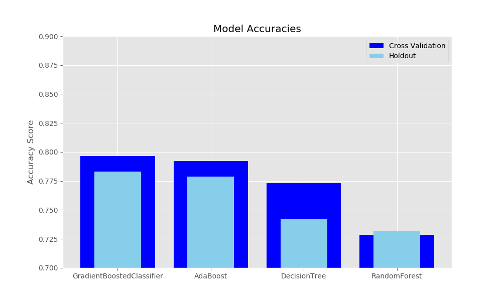
 

# Relevance to the real world

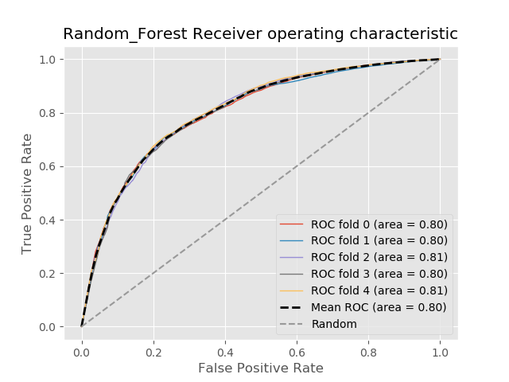
 

| Model                     |   1st | 	2nd |  3rd | 	4th| 	  5th | 
|:--------------------------|--------------:|---------------:|------------:|--------------:|---------------:|
GradientBoosted| weekday_pct | low_passenger_rating | surge_pct            | city_king's landing    | luxury_car_user |
Adaboost| weekday_pct | city king's landing  | low_passenger_rating | high_passenger_rating  | luxury_car_user |
RandomForest| avg_dist    | week_day_pct         | surge_pct            | trips_in_first_30_days | avg_surge       |
DecisionTree| surge_pct   | week_day_pct         | city_king's landing  | avg_dist               | luxury_car_user |

 

We would recommend that the company look at service/drivers in the King's Landing city, as riders in this area are one of the most important factors in predicting churn. Additionally, passengers who did not give drivers an average score of 5 stars seem to be more likely to churn. The company could reach out to these customers and offer them discounts if possible, and entice more feedback from these customers to determine specific reasons why these customers are not continuing service. 

Also, weekday ridership is consistently in the top important features. We would recommend perhaps looking at the number of available drivers on weekdays, as perhaps customers are getting frustrated that not many are available during this time and are giving up on the ride share service.

# Areas for future work

- Retry models using time from signup to last trip date - See if longer term customers are more likely to churn
- Generate partial dependence plots and/or Individual Conditional Expection plots to confirm positive or negative feature impacts
- Generate ROC curves for all models
- Cost/Profit matrix

Sources Used:
https://www.investorsobserver.com/news/stock-update/lyft-inc-lyft-stock-gains-3-14-this-week-should-you-buy-it
