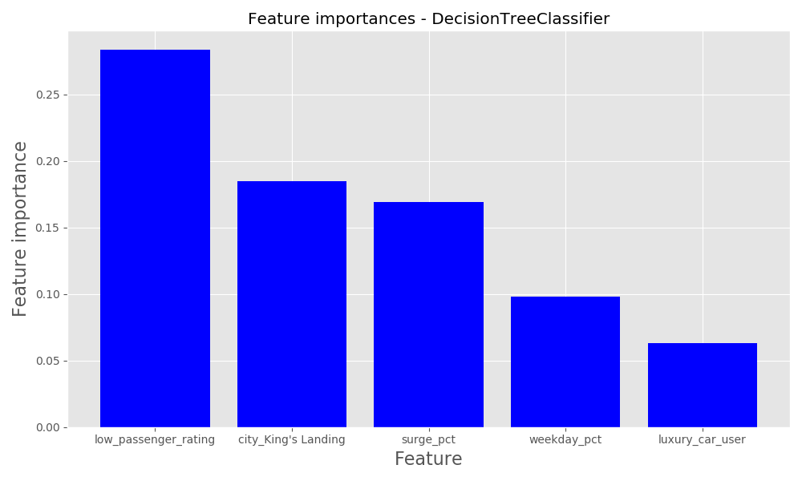

# Ride-share Churn

We loaded the data into a pandas dataframe and conducted the EDA.  Upon initial investigation, we've decided to conducting the following data cleaning:

- 'phone', converted to dummies.  The baseline model corresponds to the unspecified phone type. 
- 'avg_rating_by_driver' and 'avg_rating_of_driver'.  After debating b/w filling in the missing values with column means and converting the data into dummy columns, we decided on giving it a rating threshold.  Any rating above the threshold will be high rating and lower will be low rating.  The missing rating observations are of it's own category (that corresponds to the base model). We've tried both 4 and 5 for the threshold. 
- The target variable is generated by checking the last_trip_date with 2014-06-01.
    
    

## EDA and feature engineering
W/decisiontreee've plotted some historgrams and cross-plotting charts to explore the data. 

## Modeling approach

For this study, we've decided to try a few of the non-parametric models, fine-tune each model and compare the results.  The following models are considered: 

### Regular Decision Tree

Surprisingly, a regular decision tree without bagging or aggregating performed reasonably competitively with the other models. 

 

### Random Forest 

### Gradient Boosted Trees Boosted Trees

We've decided to try two types of boosting algorithms - The Gradient Boost and The AdaBoost.  

# How we decided on our final model
| Model                     |   Accuracy_CV |   Precision_CV |   Recall_CV |   Accuracy_HO |   Precision_HO |   Recall_HO |
|:--------------------------|--------------:|---------------:|------------:|--------------:|---------------:|------------:|
| GradientBoostedClassifier |      0.796625 |       0.813265 |    0.871567 |        0.7831 |       0.80606  |    0.85822  |
| AdaBoost                  |      0.792375 |       0.806253 |    0.874798 |        0.7787 |       0.79869  |    0.861913 |
| DecisionTree              |      0.77325  |       0.814481 |    0.827765 |        0.742  |       0.779356 |    0.82501  |
| RandomForest              |      0.733125 |       0.782442 |    0.785772 |        0.736  |       0.785396 |    0.79271  |
 

 
# Model results on unseen data

# Relevance to the real world

Add profit-curve

# Areas for future work

Possibly retry models using time from signup to last trip date - See if longer term customers are more likely to churn

To determine real-world relevance, you usually need to bring in your out-of-model knowledge to quantify the cost-benefit of performance metrics. Recall your profit-curve assignment!

Sources Used:
https://www.investorsobserver.com/news/stock-update/lyft-inc-lyft-stock-gains-3-14-this-week-should-you-buy-it
