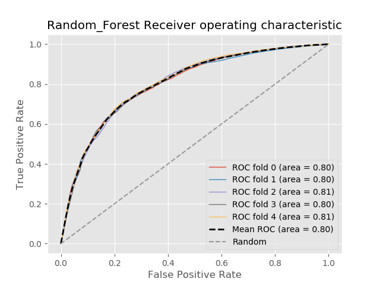

# Ride-share Churn

We loaded the data into a pandas dataframe and conducted the EDA.  Upon initial investigation, we've decided to conducting the following data cleaning:

- 'phone', converted to dummies.  The baseline model corresponds to the unspecified phone type. 
- 'avg_rating_by_driver' and 'avg_rating_of_driver'.  After debating b/w filling in the missing values with column means and converting the data into dummy columns, we decided on giving it a rating threshold.  Any rating above the threshold will be a 'high rating' and lower will be 'low rating'.  The missing rating observations are of it's own category (that corresponds to the base model). We've tried both 4 and 5 for the threshold. 
- The target variable is generated by checking the last_trip_date with 2014-06-01.

Added Feature Booleans:
- city_King's Landing
- city_Winterfell
- phone_Android
- phone_iPhone
- high_driver_rating
- low_driver_rating
- high_passenger_rating
- low_passenger_rating 

## EDA and feature engineering
With our decision tree we've plotted some historgrams and cross-plotting charts to explore the data. 

## Modeling approach

For this study, we've decided to try a few of the non-parametric models, fine-tune each model and compare the results.  The following models are considered: 

## Random Forest

### Regular Decision Tree

Surprisingly, a regular decision tree without bagging or aggregating performed reasonably competitively with the other models. 

 

With Adaboost

## Gradient Boosted Classifier

## Model Results
| Model                     |   Accuracy_CV |   Precision_CV |   Recall_CV |   Accuracy_HO |   Precision_HO |   Recall_HO |
|:--------------------------|--------------:|---------------:|------------:|--------------:|---------------:|------------:|
| GradientBoostedClassifier |      0.7966 |       0.8133 |    0.8716 |        0.7831 |       0.8060  |    0.8582  |
| AdaBoost                  |      0.7923 |       0.8063 |    0.8747 |        0.7787 |       0.7986  |    0.8619 |
| DecisionTree              |      0.7732  |       0.8145 |    0.8278 |        0.742  |       0.7794 |    0.8250  |
| RandomForest              |      0.7331 |       0.7824 |    0.7858 |        0.736  |       0.7854 |    0.7927  |
 

 

# Relevance to the real world

We would recommend that the company look at service/drivers in the King's Landing city, as riders in this area are one of the most important factors in predicting churn. Additionally, passengers who did not give drivers an average score of 5 stars are likely to churn. 
Also, weekday ridership is consistently in the top important features. We would recommend perhaps looking at the number of available drivers on weekdays, as possibly customers are getting frustrated that not many are available during this time.

# Areas for future work

- Possibly retry models using time from signup to last trip date - See if longer term customers are more likely to churn.
- Cost/Profit matrix

Sources Used:
https://www.investorsobserver.com/news/stock-update/lyft-inc-lyft-stock-gains-3-14-this-week-should-you-buy-it
