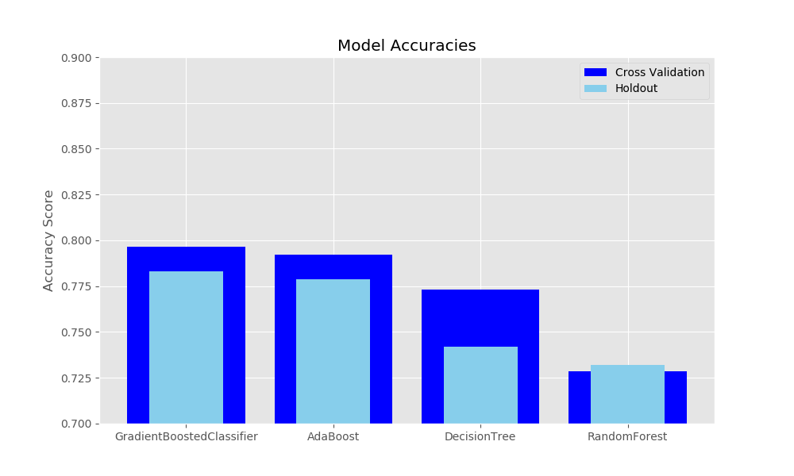

# Ride-share Churn

Company X is trying to predict what factors in their dataset contribute to churn in their ride sharing customers. Churn is defined as anyone who has not taken a ride in the last 30 days.

To help explore this question, we have provided a sample dataset of a cohort of users who signed up for an account in January 2014. The data was pulled on July 1, 2014; we consider a user retained if they were “active” (i.e. took a trip) in the preceding 30 days (from the day the data was pulled). In other words, a user is "active" if they have taken a trip since June 1, 2014.

## Raw Data and Cleaning

The raw data contains the following fields:

- `city`: city this user signed up in phone: primary device for this user
- `signup_date`: date of account registration; in the form `YYYYMMDD`
- `last_trip_date`: the last time this user completed a trip; in the form `YYYYMMDD`
- `avg_dist`: the average distance (in miles) per trip taken in the first 30 days after signup
- `avg_rating_by_driver`: the rider’s average rating over all of their trips 
- `avg_rating_of_driver`: the rider’s average rating of their drivers over all of their trips 
- `surge_pct`: the percent of trips taken with surge multiplier > 1 
- `avg_surge`: The average surge multiplier over all of this user’s trips 
- `trips_in_first_30_days`: the number of trips this user took in the first 30 days after signing up 
- `luxury_car_user`: TRUE if the user took a luxury car in their first 30 days; FALSE otherwise 
- `weekday_pct`: the percent of the user’s trips occurring during a weekday

We loaded the data into a pandas dataframe and conducted the EDA.  Upon initial investigation, we've decided to conducting the following data cleaning:

- 'phone', converted to dummies.  The baseline model corresponds to the unspecified phone type. 
- 'avg_rating_by_driver' and 'avg_rating_of_driver'.  After debating b/w filling in the missing values with column means and converting the data into dummy columns, we decided on giving it a rating threshold.  Any rating above the threshold will be high rating and lower will be low rating.  The missing rating observations are of it's own category (that corresponds to the base model). We've tried both 4 and 5 for the threshold. 
- The target variable is generated by checking the last_trip_date with 2014-06-01.
    

## EDA and feature engineering
W/decisiontreee've plotted some historgrams and cross-plotting charts to explore the data. 

## Modeling approach

For this study, we've decided to try a few of the non-parametric models, fine-tune each model and compare the results.  The following models are considered: 

### Regular Decision Tree

Surprisingly, a regular decision tree without bagging or aggregating performed reasonably competitively with the other models. 

 
Random Forest - Jacob

Gradient Boosted Trees Boosted Trees - Allison

MVP+ : Logistic Regression - Need standardization -

MLP 

# How we decided on our final model
| Model                     |   Accuracy_CV |   Precision_CV |   Recall_CV |   Accuracy_HO |   Precision_HO |   Recall_HO |
|:--------------------------|--------------:|---------------:|------------:|--------------:|---------------:|------------:|
| GradientBoostedClassifier |      0.796625 |       0.813265 |    0.871567 |        0.7831 |       0.80606  |    0.85822  |
| AdaBoost                  |      0.792375 |       0.806253 |    0.874798 |        0.7787 |       0.79869  |    0.861913 |
| DecisionTree              |      0.77325  |       0.814481 |    0.827765 |        0.742  |       0.779356 |    0.82501  |
| RandomForest              |      0.733125 |       0.782442 |    0.785772 |        0.736  |       0.785396 |    0.79271  |
 

 
# Model results on unseen data

# Relevance to the real world

Add profit-curve

# Areas for future work

Possibly retry models using time from signup to last trip date - See if longer term customers are more likely to churn

To determine real-world relevance, you usually need to bring in your out-of-model knowledge to quantify the cost-benefit of performance metrics. Recall your profit-curve assignment!

A ride-sharing company (Company X) is interested in predicting rider retention.
To help explore this question, we have provided a sample dataset of a cohort of
users who signed up for an account in January 2014. The data was pulled on July
1, 2014; we consider a user retained if they were “active” (i.e. took a trip)
in the preceding 30 days (from the day the data was pulled). In other words, a
user is "active" if they have taken a trip since June 1, 2014. The data,
`churn.csv`, is in the [data](data) folder.  The data are split into train and
test sets.  You are encouraged to tune and estimate your model's performance on
the train set, then see how it does on the unseen data in the test set at the
end.

We would like you to use this data set to help understand **what factors are
the best predictors for retention**, and offer suggestions to help Company X. 
Therefore, your task is not only to build a
model that minimizes error, but also a model that allows you to interpret the
factors that contributed to your predictions.

Sources Used:
https://www.investorsobserver.com/news/stock-update/lyft-inc-lyft-stock-gains-3-14-this-week-should-you-buy-it
